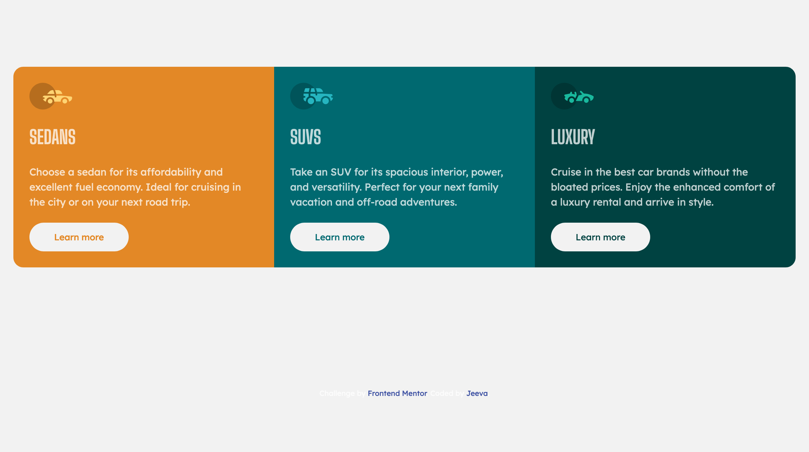

# Frontend Mentor - 3-column preview card component solution

This is a solution to the [3-column preview card component challenge on Frontend Mentor](https://www.frontendmentor.io/challenges/3column-preview-card-component-pH92eAR2-). Frontend Mentor challenges help you improve your coding skills by building realistic projects. 

## Table of contents

- [Overview](#overview)
  - [The challenge](#the-challenge)
  - [Screenshot](#screenshot)
  - [Links](#links)
- [My process](#my-process)
  - [Built with](#built-with)
  - [What I learned](#what-i-learned)
  - [Useful resources](#useful-resources)
- [Author](#author)
- [Acknowledgments](#acknowledgments)

## Overview

### The challenge

Users should be able to:

- View the optimal layout depending on their device's screen size
- See hover states for interactive elements

### Screenshot




### Links

- Solution URL: [Frontend Mentor](https://www.frontendmentor.io/profile/jeevatek)
- Live Site URL: [Github](https://jeevatek.github.io/three-column-preview-card-component/)


## My process

### Built with

- Semantic HTML5 markup
- CSS custom properties
- Flexbox
- CSS Grid
- Mobile-first workflow

### What I learned


```css
.btn {
  border: 1px solid transparent;
}
```


### Useful resources

- [MDN Documentation](https://developer.mozilla.com) - This helped me for any quick references.
- [Traversy Media](https://www.traversymedia.com) - This is an amazing resources, helped me lot.

## Author

- jeevatek - [jeevatek](https://tek.jeeva.ca)
- Frontend Mentor - [@jeevatek](https://www.frontendmentor.io/profile/jeevatek)
- Twitter - [@jeevatek](https://www.twitter.com/jeevatek)

## Acknowledgments

@jonasschmedtman - Udemy Course
